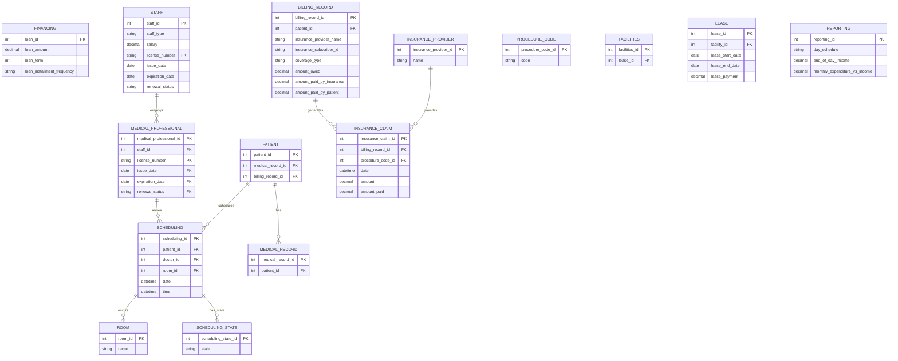

# CSCI 585 HW1, ER diagram

Sohail Gidwani (sgidwani@usc.edu)

The diagram I am submitting is the GPT-6 Astra Max one below. It is in this repo
as `diagram/ER-diagram-final.png` with its mermaid source next to it. Everything
under "the other models" is just what else I tried, it is not my answer.

This file is the same content as `README.txt`, I just made a markdown version so
the diagrams render instead of you having to open the PNGs. Only the diagrams
that actually parse are embedded here.

## What I tried

I did the ollama route from the assignment first, llama3 and gemma2:2b running
locally side by side in the streamlit app, same prompt going to both at once.
Then I ran the same task on GPT-6 Astra Max through my USC ChatGPT Edu account
and on Gemini 3.6 Thinking through the USC google account. Four models total.

| model | entities | relationships | orphan entities | parsed as given |
|---|---|---|---|---|
| GPT-6 Astra Max | 28 | 34 | none | yes, no edits |
| Gemini 3.6 Thinking | 23 | 23 | none | no, needed a comma in 2 places |
| llama3 (2nd attempt) | 15 | 8 | 5 | no, needed the erDiagram line added |
| gemma2:2b | n/a | n/a | n/a | no, never parsed |

## The diagram I am submitting, GPT-6 Astra Max

This is exactly what the model gave me, I did not edit it.

```mermaid
erDiagram
    direction TB

    EMPLOYEE ||--o| MEDICAL_PROFESSIONAL : specializes_as
    EMPLOYEE ||--o| FRONT_OFFICE_STAFF : specializes_as
    MEDICAL_PROFESSIONAL ||--|{ PROFESSIONAL_LICENSE : holds
    EMPLOYEE ||--o{ PAYROLL_ENTRY : earns

    SCHEDULING_STATE ||--o{ PATIENT : classifies
    PATIENT ||--o{ PATIENT_CONTACT : receives
    FRONT_OFFICE_STAFF ||--o{ PATIENT_CONTACT : records
    FACILITY ||--|{ ROOM : contains
    FACILITY ||--o{ LEASE : has
    PATIENT ||--o{ APPOINTMENT : attends
    MEDICAL_PROFESSIONAL ||--o{ APPOINTMENT : is_scheduled_for
    FRONT_OFFICE_STAFF ||--o{ APPOINTMENT : schedules
    ROOM ||--o{ APPOINTMENT : hosts

    APPOINTMENT ||--o{ PERFORMED_SERVICE : includes
    MEDICAL_PROFESSIONAL ||--o{ PERFORMED_SERVICE : performs
    SERVICE_TYPE ||--o{ PERFORMED_SERVICE : classifies
    PATIENT ||--o{ PATIENT_COVERAGE : holds
    INSURANCE_PROVIDER ||--o{ PATIENT_COVERAGE : underwrites
    PATIENT_COVERAGE ||--o{ INSURANCE_CLAIM : applies_to
    PERFORMED_SERVICE ||--o{ INSURANCE_CLAIM : supports
    PATIENT ||--o{ PAYMENT : has
    INSURANCE_PROVIDER |o--o{ PAYMENT : remits
    PAYMENT ||--|{ PAYMENT_ALLOCATION : comprises
    PERFORMED_SERVICE ||--o{ PAYMENT_ALLOCATION : receives
    INSURANCE_CLAIM |o--o{ PAYMENT_ALLOCATION : explains

    BANK ||--o{ LOAN : provides
    LOAN ||--|{ LOAN_INSTALLMENT : schedules
    LOAN_INSTALLMENT ||--o{ LOAN_PAYMENT : receives
    COST_CATEGORY ||--o{ COST_ENTRY : classifies
    COST_ENTRY ||--o{ COST_PAYMENT : receives
    COST_ENTRY ||--o| PAYROLL_ENTRY : details
    LEASE ||--|{ LEASE_CHARGE : schedules
    COST_ENTRY ||--o| LEASE_CHARGE : details
    COST_ENTRY ||--o| FIXED_ASSET : capitalizes

    EMPLOYEE {
        int employee_id PK
        string full_name
        date hired_on
        date terminated_on
        decimal monthly_salary
    }

    MEDICAL_PROFESSIONAL {
        int medical_professional_id PK
        int employee_id FK
        string primary_profession
    }

    FRONT_OFFICE_STAFF {
        int front_office_staff_id PK
        int employee_id FK
    }

    PROFESSIONAL_LICENSE {
        int license_id PK
        int medical_professional_id FK
        string issuing_state
        string license_number
        string license_type
        date valid_from
        date expires_on
        string license_status
        date verified_on
    }

    SCHEDULING_STATE {
        int scheduling_state_id PK
        string state_name UK
    }

    PATIENT {
        int patient_id PK
        int scheduling_state_id FK
        string full_name
        date date_of_birth
        string phone
        string email
    }

    PATIENT_CONTACT {
        int contact_id PK
        int patient_id FK
        int front_office_staff_id FK
        datetime contacted_at
        string contact_method
        string outcome
    }

    FACILITY {
        int facility_id PK
        string street_address
        string state
    }

    ROOM {
        int room_id PK
        int facility_id FK
        string room_number
    }

    APPOINTMENT {
        int appointment_id PK
        int patient_id FK
        int scheduled_professional_id FK
        int front_office_staff_id FK
        int room_id FK
        datetime starts_at
        datetime ends_at
        string appointment_status
    }

    SERVICE_TYPE {
        int service_type_id PK
        string cdt_code UK
        string service_name
        string service_kind
    }

    PERFORMED_SERVICE {
        int performed_service_id PK
        int appointment_id FK
        int medical_professional_id FK
        int service_type_id FK
        datetime performed_at
        decimal billed_amount
        string clinical_indication
        string clinical_notes
    }

    INSURANCE_PROVIDER {
        int insurance_provider_id PK
        string provider_name
    }

    PATIENT_COVERAGE {
        int patient_coverage_id PK
        int patient_id FK
        int insurance_provider_id FK
        string subscriber_id
        string coverage_type
        decimal coverage_amount
        date effective_from
        date effective_to
    }

    INSURANCE_CLAIM {
        int insurance_claim_id PK
        int performed_service_id FK
        int patient_coverage_id FK
        datetime submitted_at
        decimal amount_claimed
        string claim_status
    }

    PAYMENT {
        int payment_id PK
        int patient_id FK
        int insurance_provider_id FK
        string payer_type
        datetime received_at
        decimal amount
        string payment_reference
    }

    PAYMENT_ALLOCATION {
        int payment_allocation_id PK
        int payment_id FK
        int performed_service_id FK
        int insurance_claim_id FK
        decimal amount_applied
    }

    BANK {
        int bank_id PK
        string bank_name
    }

    LOAN {
        int loan_id PK
        int bank_id FK
        decimal original_principal
        decimal annual_interest_rate
        date disbursed_on
        int term_months
    }

    LOAN_INSTALLMENT {
        int loan_installment_id PK
        int loan_id FK
        int installment_number
        date interest_period_end
        date due_on
        decimal principal_due
        decimal interest_due
    }

    LOAN_PAYMENT {
        int loan_payment_id PK
        int loan_installment_id FK
        date paid_on
        decimal principal_paid
        decimal interest_paid
    }

    COST_CATEGORY {
        int cost_category_id PK
        string category_name UK
        string accounting_treatment
    }

    COST_ENTRY {
        int cost_entry_id PK
        int cost_category_id FK
        date recognized_on
        date due_on
        decimal amount
        string cost_phase
        string payee_name
        string description
    }

    COST_PAYMENT {
        int cost_payment_id PK
        int cost_entry_id FK
        date paid_on
        decimal amount_paid
    }

    PAYROLL_ENTRY {
        int payroll_entry_id PK
        int employee_id FK
        int cost_entry_id FK
        date salary_month
    }

    LEASE {
        int lease_id PK
        int facility_id FK
        string landlord_name
        date starts_on
        date ends_on
        decimal monthly_rent
    }

    LEASE_CHARGE {
        int lease_charge_id PK
        int lease_id FK
        int cost_entry_id FK
        date rent_month
    }

    FIXED_ASSET {
        int fixed_asset_id PK
        int cost_entry_id FK
        string asset_name
        date in_service_on
        int useful_life_months
        decimal residual_value
    }
```



## The other models

### Gemini 3.6 Thinking

Good design, and second best of the four. It wrote `int staff_id PK FK` in two
places though, and mermaid wants `int staff_id PK, FK`, so it would not parse
until I added those two commas. The version below has that fix in it, nothing
else is changed.

```mermaid
erDiagram
    LOAN {
        int loan_id PK
        string lender_name
        decimal principal_amount
        decimal interest_rate
        int term_months
        date start_date
    }

    LOAN_PAYMENT {
        int payment_id PK
        int loan_id FK
        date payment_date
        decimal amount_paid
        decimal principal_portion
        decimal interest_portion
    }

    STARTUP_COST {
        int cost_id PK
        int loan_id FK
        string category
        string description
        decimal amount
        date expense_date
    }

    STAFF {
        int staff_id PK
        string first_name
        string last_name
        string email
        decimal monthly_salary
        date hire_date
    }

    FRONT_OFFICE {
        int staff_id PK, FK
        string desk_location
    }

    MEDICAL_PROFESSIONAL {
        int staff_id PK, FK
        string specialty
    }

    LICENSE {
        int license_id PK
        int staff_id FK
        string license_number
        string state
        date expiration_date
        string status
    }

    PAYROLL_RECORD {
        int payroll_id PK
        int staff_id FK
        date pay_date
        decimal gross_amount
        decimal net_amount
    }

    PATIENT {
        int patient_id PK
        string first_name
        string last_name
        date date_of_birth
        string phone
        string scheduling_state
    }

    INSURANCE_PROVIDER {
        int provider_id PK
        string provider_name
        string phone_number
    }

    PATIENT_INSURANCE {
        int patient_insurance_id PK
        int patient_id FK
        int provider_id FK
        string subscriber_id
        string coverage_type
        decimal coverage_amount
    }

    ROOM {
        int room_id PK
        string room_number
        string room_type
    }

    APPOINTMENT {
        int appointment_id PK
        int patient_id FK
        int doctor_id FK
        int room_id FK
        int scheduled_by_id FK
        datetime appointment_datetime
        string status
    }

    CDT_CODE {
        string cdt_code PK
        string category
        string description
        decimal standard_fee
    }

    PATIENT_PROCEDURE {
        int procedure_id PK
        int appointment_id FK
        string cdt_code FK
        decimal fee_charged
        string notes
    }

    INSURANCE_CLAIM {
        int claim_id PK
        int patient_insurance_id FK
        int procedure_id FK
        date claim_date
        decimal amount_billed
        decimal amount_paid
        string claim_status
    }

    PATIENT_PAYMENT {
        int payment_id PK
        int patient_id FK
        int appointment_id FK
        date payment_date
        decimal amount_paid
        string payment_method
    }

    LEASE {
        int lease_id PK
        string property_address
        decimal monthly_rent
        date start_date
        date end_date
    }

    LEASE_PAYMENT {
        int lease_payment_id PK
        int lease_id FK
        date payment_date
        decimal amount_paid
    }

    SUPPLY_ITEM {
        int item_id PK
        string item_name
        string category
        decimal unit_cost
        int stock_quantity
    }

    SUPPLY_ORDER {
        int order_id PK
        int staff_id FK
        date order_date
        decimal total_cost
    }

    SUPPLY_ORDER_ITEM {
        int order_item_id PK
        int order_id FK
        int item_id FK
        int quantity
        decimal unit_price
    }

    OPERATING_EXPENSE {
        int expense_id PK
        int staff_id FK
        string category
        string description
        decimal amount
        date expense_date
    }

    LOAN ||--o{ LOAN_PAYMENT : "has"
    LOAN ||--o{ STARTUP_COST : "finances"
    STAFF ||--o| FRONT_OFFICE : "is"
    STAFF ||--o| MEDICAL_PROFESSIONAL : "is"
    STAFF ||--o{ PAYROLL_RECORD : "receives"
    STAFF ||--o{ SUPPLY_ORDER : "places"
    STAFF ||--o{ OPERATING_EXPENSE : "logs"
    MEDICAL_PROFESSIONAL ||--o{ LICENSE : "holds"
    MEDICAL_PROFESSIONAL ||--o{ APPOINTMENT : "conducts"
    FRONT_OFFICE ||--o{ APPOINTMENT : "schedules"
    PATIENT ||--o{ PATIENT_INSURANCE : "has"
    PATIENT ||--o{ APPOINTMENT : "attends"
    PATIENT ||--o{ PATIENT_PAYMENT : "makes"
    INSURANCE_PROVIDER ||--o{ PATIENT_INSURANCE : "issues"
    PATIENT_INSURANCE ||--o{ INSURANCE_CLAIM : "claims"
    ROOM ||--o{ APPOINTMENT : "hosts"
    APPOINTMENT ||--o{ PATIENT_PROCEDURE : "includes"
    APPOINTMENT ||--o{ PATIENT_PAYMENT : "settles"
    CDT_CODE ||--o{ PATIENT_PROCEDURE : "defines"
    PATIENT_PROCEDURE ||--o| INSURANCE_CLAIM : "generates"
    LEASE ||--o{ LEASE_PAYMENT : "incurs"
    SUPPLY_ORDER ||--|{ SUPPLY_ORDER_ITEM : "contains"
    SUPPLY_ITEM ||--o{ SUPPLY_ORDER_ITEM : "included_in"
```



### llama3 (second attempt)

First time round llama3 gave me class diagram syntax, so every entity came out as
`class STAFF {` which mermaid will not parse, and it had zero relationship lines
so it was really just a list of tables. I pasted its broken output back in with a
note on what was wrong and this is what it gave me the second time. The syntax is
fixed and the relationships are there now, but 5 entities (FINANCING,
PROCEDURE_CODE, FACILITIES, LEASE, REPORTING) still have nothing connecting them,
you can see them floating along the top when it renders.

I also had to move `erDiagram` onto its own line, because llama3 had put it in the
code fence tag instead of inside the block.



### gemma2:2b

Not embedding this one because it never parsed, it would just show an error box.
Every run it copied the CUSTOMER and ORDER example straight out of the mermaid
docs into my dental diagram, and it kept writing attributes backwards as
`PK staff_id int` instead of `int staff_id PK`. Mermaid says:

```text
Parse error on line 25: ...CHEDULING {  PK scheduling_id int
Expecting 'BLOCK_STOP', 'ATTRIBUTE_WORD', ',', 'COMMENT', got 'ATTRIBUTE_KEY'
```

Its entity blocks also had no attributes inside them at all. The raw output is in
`models/gemma2-2b/raw-output.txt` and the one render I did get out
of it is `models/gemma2-2b/rendered-diagram.png`.

## Why I picked the GPT-6 one

The counts are in the table above, 28 entities and 34 relationships with no
orphans, and it parsed with no edits from me at all. But the bigger reason is that
it handles the money side much better, and this business is mostly about money.

1. One cost ledger. `COST_CATEGORY` and `COST_ENTRY` with `PAYROLL_ENTRY`,
   `LEASE_CHARGE` and `FIXED_ASSET` extending it for salaries, rent and equipment.
   So the monthly profit and loss report is one query. In the Gemini design the
   expenses sit in five separate tables and you have to union all of them.

2. `LOAN_INSTALLMENT` (what is scheduled) is separate from `LOAN_PAYMENT` (what
   actually got paid), with principal and interest kept apart. The assignment says
   the loan is paid off in installments over 10 years, so the schedule is part of
   the requirement. Gemini only models the payments.

3. `PAYMENT_ALLOCATION` sits between payments and charges. This is the part I
   liked most. One insurance cheque can cover six procedures, a patient can pay a
   bill in parts, and amount owed vs amount paid by insurance vs amount paid by the
   patient still all come out right. Without it you cannot really answer those
   three numbers.

4. The five scheduling states are a proper lookup table on the one side of the
   relationship. Gemini made `scheduling_state` a string column on `PATIENT`,
   which works but is weaker.

5. `PATIENT_CONTACT` means a front office person phoning a patient gets recorded
   even when the call does not turn into an appointment, which the description
   specifically asks for.

The one place Gemini is better is supplies. It models `SUPPLY_ITEM`,
`SUPPLY_ORDER` and `SUPPLY_ORDER_ITEM` with stock quantities and GPT-6 just treats
restocking as another cost entry. I still went with GPT-6 because it says in its
own notes that it is leaving inventory out on purpose, and the assignment says
some things will not fit in an ER diagram and that is fine. A gap that is written
down reads better to me than one that is just missing.

## The design itself

The rationale here is condensed from the design notes GPT-6 produced with the
diagram. I cut it down and kept the parts I agree with and can defend.

Staff. `EMPLOYEE` is the supertype and every employee is either a
`MEDICAL_PROFESSIONAL` or `FRONT_OFFICE_STAFF`, total and disjoint. Licenses hang
off `MEDICAL_PROFESSIONAL` only, because front office people do not have them.
Each license row has its state, number, validity dates, status and a verified
date, so you can check who is expiring. Salary is monthly on `EMPLOYEE` and the
historical amounts live in the payroll cost entries, so old salaries are not lost
when someone gets a raise.

Appointments. An appointment has one patient, one room, one scheduled doctor and
one front office person who booked it. The doctor who is scheduled and the doctor
who actually did the work are stored separately, because those are not always the
same person. `FACILITY` and `ROOM` are separate from `LEASE` so that if the lease
gets renewed the rooms keep their identity.

Medical records. Procedures, treatments and surgeries are all `SERVICE_TYPE` rows
told apart by `service_kind`, since all three are the same shape of thing, they
are just a CDT code and a fee. `PERFORMED_SERVICE` is one actual thing done to one
patient at one appointment. The medical record is not a stored table, you get it
by following the patient to their appointments to their performed services.

Insurance. `PATIENT_COVERAGE` sits between `PATIENT` and `INSURANCE_PROVIDER` so a
patient can have no insurance, or more than one policy, or change policy over
time. A claim bills one performed service against one coverage row. The subscriber
ID, CDT code and treatment date are not copied onto the claim, you reach them
through the relationships.

Reports. The morning schedule, the end of day billable income and the monthly
profit and loss are all queries, not tables. I did not store any of them. Daily
income is the sum of billed amounts on services performed that day. Monthly profit
and loss is service charges minus recognised costs, loan interest and
depreciation.

## What is not modelled

Supply quantities and inventory levels, as mentioned above. Also invoice headers
as their own entity, treatment plans, refunds and write offs, tax, and the history
of a patient moving between scheduling states, only the current state is stored.

Some of the rules cannot be drawn in an ER diagram at all and would need database
constraints or application code. Two appointments must not overlap in the same
room, a patient must have exactly one scheduling state, an employee cannot be in
both subtypes at once, and the payment allocations against a payment have to add
up to that payment and not overpay a charge.

## What is in this folder

```
diagram/                 the ER diagram I am submitting, mermaid source and png
prompts/                 every prompt I used, numbered in the order I used them
models/                  one folder per model, raw output and whatever it produced
screenshots/             prompt and output screenshots for all three sessions
app/                     the streamlit app from the assignment, for the two local models
README.md                this file
README.txt               same content in plain text, this is the one I submit
```

The submission zip is not committed, it is just these same files repackaged. It
is laid out differently from this folder on purpose, so that a grader opening it
sees one ER diagram at the top level and everything else under a comparison
folder. `README.txt` lists that layout.

A couple of things are deliberately not committed. The assignment PDF and the
`spec/` folder came off bytes.usc.edu and belong to the professor, so I kept my
local copies but did not push them.
