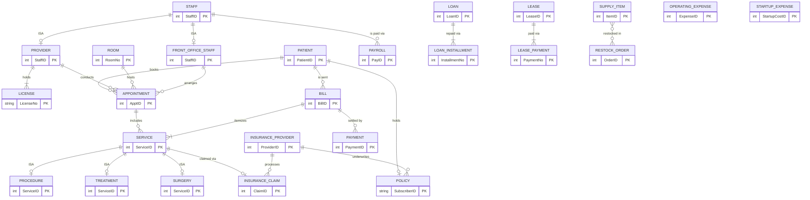
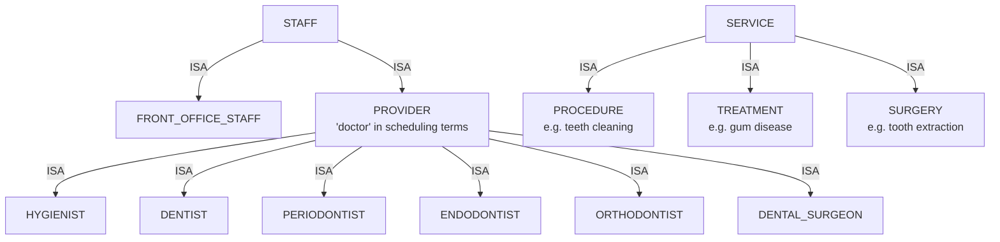

Great assignment — this is the classic CSCI 585 "design the big pieces" ER exercise. Since I'm in Ask mode I won't create any files, but here is a complete conceptual design you can redraw in your diagram tool of choice (draw.io, ERDPlus, Lucidchart), plus the rationale document the prompt asks for.

## 1. Design approach

The narrative splits naturally into four clusters:

- **People**: staff (with an EER specialization for license-holding medical professionals), patients
- **Clinical operations**: rooms, appointments, services (procedures/treatments/surgeries — another EER hierarchy)
- **Insurance & billing**: providers, policies, claims, bills, payments
- **Business finance**: loan, lease, payroll, supplies, startup & operating expenses

Reports (daily schedule, daily billable income, monthly P&L) are **derived data** — queries/views over stored entities, not entities themselves. More on that in §5.

## 2. The EER diagram

Notes on notation: the `ISA` edges are EER specializations (drawn as relationships only because crow's-foot tools can't express them — see §3). `LOAN_INSTALLMENT` and `LEASE_PAYMENT` are **weak entities** (identifying relationship with their parent; partial key = installment/payment number). The `restocked in` M:N carries relationship attributes `(Qty, UnitPrice)` — it becomes an associative entity at detailed design.

## 3. Specialization hierarchies (the EER part)

Constraints: `STAFF → {FRONT_OFFICE_STAFF, PROVIDER}` is **total and disjoint** (every employee is exactly one kind). `PROVIDER → {6 specialties}` is **disjoint** by primary specialty. `SERVICE → {PROCEDURE, TREATMENT, SURGERY}` is **total and disjoint**.

## 4. Entities and attributes

**People**

| Entity | Attributes | Notes |
|---|---|---|
| STAFF | **StaffID**, Name, Phone, Email, Address, HireDate, MonthlySalary | Superclass; salary stored here since everyone is salaried monthly |
| PROVIDER | **StaffID** (FK), Specialty | "Doctors" per the brief = hygienists + all dentist types |
| FRONT_OFFICE_STAFF | **StaffID** (FK), Role | Do scheduling/contacting |
| LICENSE | **LicenseNo**, StaffID (FK→PROVIDER), Type, IssueDate, ExpiryDate, Status | Only providers hold licenses — exactly why the subclass exists |
| PATIENT | **PatientID**, Name, DOB, Phone, Email, Address, SchedState | SchedState ∈ {contacted, scheduled, recently visited, up for next visit, dormant} |

**Clinical operations**

| Entity | Attributes | Notes |
|---|---|---|
| ROOM | **RoomNo**, Description | The 8 rooms |
| APPOINTMENT | **ApptID**, PatientID (FK), ProviderID (FK), RoomNo (FK), StaffID (FK→FrontOffice), Date, StartTime, EndTime, Status | Entity (not a ternary relationship) so services and status hang off it |
| SERVICE | **ServiceID**, ApptID (FK), BillID (FK), Code, Description, ServiceDate, Fee | Code = CDT-style treatment code used on claims |
| PROCEDURE / TREATMENT / SURGERY | **ServiceID** (FK), + subtype-specific attrs later (e.g., SURGERY.AnesthesiaType, TREATMENT.Diagnosis) | A patient's medical record = all their services via appointments |

**Insurance & billing**

| Entity | Attributes | Notes |
|---|---|---|
| INSURANCE_PROVIDER | **ProviderID**, Name, Phone, Address, ContactPerson | The "list of providers" requirement |
| POLICY | **SubscriberID**, PatientID (FK), ProviderID (FK), CoverageType, CoverageAmount | Patient participation is optional — "bulk" carry insurance, not all |
| BILL | **BillID**, PatientID (FK), BillDate, AmountOwed | AmountPaidByInsurance / AmountPaidByPatient are *derived* (sums of payments by source) |
| PAYMENT | **PaymentID**, BillID (FK), PayDate, Amount, Source {patient, insurance}, Method | Gives you payment dates → makes the monthly income report possible |
| INSURANCE_CLAIM | **ClaimID**, ServiceID (FK), ProviderID (FK), SubscriberID, TreatmentCode, TreatmentDate, AmountClaimed, AmountPaid, ClaimDate, Status | Mirrors the claim submission described in the brief |

**Business finance**

| Entity | Attributes | Notes |
|---|---|---|
| LOAN | **LoanID**, BankName, Principal, InterestRate, TermYears, StartDate | The $300K / 10-year loan |
| LOAN_INSTALLMENT (weak) | **(LoanID FK, InstallmentNo)**, DueDate, AmountDue, AmountPaid, PaidDate, Status | The repayment schedule |
| LEASE | **LeaseID**, Landlord, PropertyAddress, MonthlyRent, StartDate, EndDate | Building near the hospital |
| LEASE_PAYMENT (weak) | **(LeaseID FK, PaymentNo)**, DueDate, Amount, PaidDate | Monthly lease schedule |
| PAYROLL | **PayID**, StaffID (FK), PayMonth, Amount, PayDate | Actual monthly salary payments |
| SUPPLY_ITEM | **ItemID**, Name, Category, UnitCost, QtyOnHand, ReorderLevel | Needles → drugs → paper towels |
| RESTOCK_ORDER | **OrderID**, OrderDate, TotalCost | M:N with SUPPLY_ITEM, line attrs (Qty, UnitPrice) |
| OPERATING_EXPENSE | **ExpenseID**, Category {cleaning, utilities, food, …}, Description, Amount, ExpenseDate | Recurring monthly costs |
| STARTUP_EXPENSE | **StartupCostID**, Category {furniture, equipment, software, supplies, training}, Description, Amount, PurchaseDate | One-time launch costs |

## 5. Design decisions (the rationale document)

1. **EER specialization for STAFF.** Licenses must be tracked *only* for medical professionals, and only providers can be scheduled into rooms — but *all* staff get paid. Putting shared attributes on `STAFF` and attaching `LICENSE`/`APPOINTMENT` to the `PROVIDER` subclass models this exactly, with no NULL-littered mega-table. This is the strongest argument for an EER over a plain ER diagram.
2. **"Doctors" = PROVIDER superclass.** The brief says hygienists and doctors together are called "doctors" for scheduling purposes — so the scheduling relationship targets `PROVIDER`, not individual specialties.
3. **Six specialties as subclasses** (rather than a `Specialty` attribute) so the design can later attach specialty-specific attributes/relationships (e.g., only `DENTAL_SURGEON` performs `SURGERY`). If you prefer simplicity, a discriminator attribute is an acceptable alternative — say so in your write-up.
4. **EER specialization for SERVICE.** The medical record explicitly consists of procedures, treatments, and surgeries. Giving them a common superclass means billing and claims reference *one* entity (every service has a code, date, and fee) while subtypes can diverge later.
5. **APPOINTMENT as an entity** tying together exactly one patient, one provider, and one room — this directly captures "8 rooms scheduled for a specific doctor and patient," and gives services and the daily schedule a natural anchor.
6. **POLICY as its own entity** between PATIENT and INSURANCE_PROVIDER. The brief's flat "billing record" is really `BILL ⋈ POLICY ⋈ INSURANCE_PROVIDER`; normalizing avoids repeating provider data per patient and cleanly allows uninsured patients (optional participation).
7. **CLAIM separate from BILL.** A claim is a transaction *with the insurer* (subscriber ID, treatment code/date, amount claimed, amount paid); a bill is what the *patient encounter* costs. One service → at most one claim; claim payments feed the bill's insurance-paid total.
8. **PAYMENT entity instead of two "amount paid" attributes** on BILL: it records *when* money arrived and from whom, which is what makes the monthly income side of the P&L computable, and handles partial payments.
9. **Weak entities for installment schedules** (loan, lease): a payment row is meaningless outside its parent obligation, so it's identified by `(LoanID, InstallmentNo)` / `(LeaseID, PaymentNo)`.
10. **STARTUP_EXPENSE kept separate from OPERATING_EXPENSE**: one-time launch costs vs. recurring monthly costs are reported differently (and startup costs may be capitalized/depreciated later).
11. **Patient scheduling state stored as an attribute** on PATIENT. It's technically derivable from appointment history, but the front office uses it as a workflow queue, so materializing it is justified — document the tradeoff.
12. **Reports are views, not tables** (avoids update anomalies):
    - *Morning schedule*: appointments for today joined to provider, patient, room, ordered by start time
    - *End-of-day billable income*: `SUM(SERVICE.Fee)` where ServiceDate = today (groupable by provider)
    - *Monthly P&L*: income = Σ PAYMENT (month); expenses = Σ PAYROLL + Σ LEASE_PAYMENT + Σ LOAN_INSTALLMENT paid + Σ RESTOCK_ORDER + Σ OPERATING_EXPENSE (month); profit = income − expenses

## 6. Assumptions I made (state yours explicitly — graders look for this)

- One loan and one lease exist now, but both are modeled so multiples are possible.
- A patient has at most one active policy; a service occurs in exactly one appointment (multi-visit treatments are recorded as one service per visit).
- Each service is billed once; each claim covers exactly one service (matches "treatment code + treatment date" claim format).
- Salaries are fixed monthly amounts; `PAYROLL` records actual disbursements.

## 7. What ER *cannot* capture (the prompt explicitly invites this)

- **No double-booking**: uniqueness over `(RoomNo, Date, StartTime)` and `(ProviderID, Date, StartTime)` — enforce via constraints/triggers.
- **License expiry alerts**: a scheduled query (`ExpiryDate − today < 60 days`), not a structure.
- **State-transition rules** for the patient scheduling states, and **coverage checks** (claim ≤ CoverageAmount).
- The **reports themselves** — they're derived.

## 8. Analytics readiness (their "grand vision")

Every transaction carries a date and nothing is ever overwritten (payments, claims, appointments accumulate), so the schema already preserves the history analytics needs. Later you can bolt on a star schema — fact tables like `FACT_SERVICE` and `FACT_PAYMENT`, dimensions like date, patient, provider, specialty, service type, insurer — without touching the operational schema.

---

If you want, I can next walk through mapping this EER to a relational schema (with normalization checks), or critique a draft diagram once you've drawn it — just switch to Agent mode if you'd like me to produce actual diagram files.
